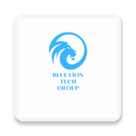

# 🦁 Blue Lion POS - NFC Mobile Payment Solution

**Blue Lion POS**, modern işletmeler için geliştirilmiş, NFC (Temassız) ödeme teknolojisini ve veri analizini bir araya getiren yenilikçi bir Android POS çözümüdür. **Blue Lion Tech Group**'un amiral gemisi projesidir.

## 🚀 Öne Çıkan Özellikler
* **NFC Payment Integration:** Temassız kartları (NFC) saniyeler içinde okur ve işlem yapar.
* **Real-time Analytics:** Günlük ciro takibi ve son 5 işlemi gösteren dinamik satış grafikleri.
* **Offline First (Room DB):** İnternet olmasa bile tüm işlemler yerel SQLite veritabanında güvenle saklanır.
* **Modern UI/UX:** Jetpack Compose ile geliştirilmiş, gece modu (Dark Mode) destekli, akıcı ve şık arayüz.
* **Fast & Secure:** Hafif yapısı sayesinde en düşük donanımlı cihazlarda bile yüksek performans.

## 🛠️ Teknik Stack
* **Language:** Kotlin
* **UI Framework:** Jetpack Compose
* **Database:** Room (SQLite)
* **Hardware:** NFC Adapter API
* **Architecture:** MVVM Design Pattern

## 📸 Uygulama Görüntüleri
| Ana Ekran | Ödeme Ekranı | Satış Analizi |
| :---: | :---: | :---: |
|  |  |  |

## 🏗️ Kurulum ve Çalıştırma
1. Projeyi bilgisayarınıza clonelayın: `git clone https://github.com/GorkemAydiner/Blue-Lion-POS.git`
2. Android Studio'da açın.
3. NFC destekli bir Android cihazda (Örn: Samsung S24+) çalıştırın.

---
© 2026 **Blue Lion Tech Group**. Tüm Hakları Saklıdır.